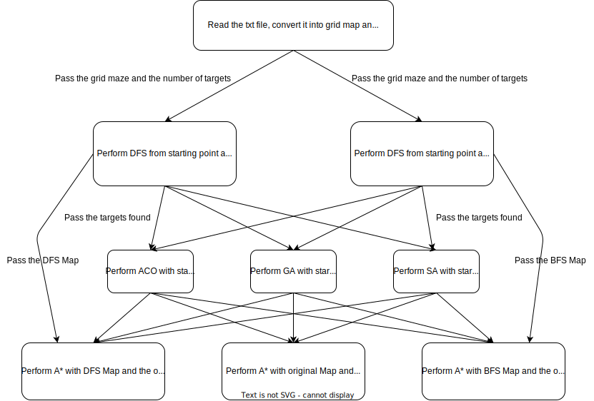

# AIT204-Project
- Perform maze exploration using DFS and BFS
- Perform path finding using A* Algorithm
- Perform path scheduling using Ant Colony Optimization Algorithm, Genetic Algorithm and Simulated Annealing with starting point fixed.
  
&nbsp;&nbsp;&nbsp;&nbsp;&nbsp;&nbsp;&nbsp;&nbsp;When utilizing metaheuristic algorithms like ACO, GA, and SA for multiple target A* pathfinding on grid maps with numerous walls, the Euclidean distance heuristic may not provide effective guidance. In such cases, the Euclidean distance heuristic can mislead these algorithms towards suboptimal solutions, as it assumes a continuous space and does not consider obstacles.

&nbsp;&nbsp;&nbsp;&nbsp;&nbsp;&nbsp;&nbsp;&nbsp;To overcome this issue, it is advisable to employ alternative heuristics that are better suited for grid-based environments. The Manhattan distance heuristic, also known as the taxicab distance, is often preferred in such scenarios. Unlike the Euclidean distance heuristic, the Manhattan distance considers obstacles and accurately estimates distances by summing the absolute differences in the x and y coordinates.

&nbsp;&nbsp;&nbsp;&nbsp;&nbsp;&nbsp;&nbsp;&nbsp;By utilizing the Manhattan distance heuristic instead of the Euclidean distance heuristic, the metaheuristic algorithms can be guided more effectively in grid-based environments with walls or obstacles. This adjustment helps to achieve better solutions and prevents the algorithms from being misled by the presence of obstacles.

&nbsp;&nbsp;&nbsp;&nbsp;&nbsp;&nbsp;&nbsp;&nbsp;It is important to note that selecting the most appropriate heuristic depends on the specific characteristics of the problem domain. Evaluating different heuristics can help determine the one that performs optimally for the given scenario.

## FlowChart

## Heuristic Functions available : 
| Heuristic | Parameter | Formula                       | Remark                            |
|-----------|-----------|-------------------------------|-----------------------------------|
| Euclidean | "euc"     |  $`\sqrt{(x_1-x_2)^2+(y_1-y_2)^2}`$                             |For any direction                  |
| Manhattan | "mht"     | $`dx+dy`$ |Better for 4 directions &uarr;&darr;&larr;&rarr;                                   |
| Diagonal  | "dia"     |$`(dx+dy)+(\sqrt{2}-2)*\min(dx,dy)`$  |Better for 8 directions &uarr;&darr;&larr;&rarr;&nwarr;&nearr;&swarr;&searr;                                |
| Euclidean2| "euc2"    |      $`(x_1-x_2)^2+(y_1-y_2)^2 `$                        |                                   |
| Chebyshev | "che"     |         $`\max(dx, dy)`$                      |                                   |

Remark : $`dx = |x_1-x_2|,\,\,dy=|y_1-y_2|`$
  
## How to Use?
To use the program, follow these steps:
1) Move into the "bin" directory of the downloaded zip file in your terminal.
2) Compile the code by running the following command in the terminal:
g++ -O3 -o main.cpp main
This will produce a main.exe file.
3) To execute the program, use the following command in the terminal:
    .\main.exe "path_to_your_testing_maze.txt" "heuristic_parameter" "number_of_directions" "-p" "-v"
    - Replace "path_to_your_testing_maze.txt" with the actual path to your testing maze file.
    - Replace "heuristic_parameter" with the desired heuristic parameter, such as "euc", "euc2", etc., as shown in the provided table of heuristic functions.
    - Replace "number_of_directions" with either 4 or 8, depending on the desired number of directions.
    - The arguments "-p" and "-v" are optional. They indicate whether you want to perform the permutation method to find the best visiting sequence and enable visualization, respectively.
    - Note that the order of the arguments is not specific. You can pass them in any order you prefer.
    Make sure to adjust the command and arguments according to your specific requirements and file paths.
4) After executing the program, you will find the result txt file and the visualization image in the "output" directory, which is located inside the "bin" directory.
5) Please note that each time you choose to enable visualization or permutation, the previous result txt file and visualization file will be deleted. This ensures that the latest results are displayed accurately.

## Limitations and Future Works
&nbsp;&nbsp;&nbsp;&nbsp;&nbsp;&nbsp;&nbsp;&nbsp;The reason for the extremely fast execution time of my A* algorithm is primarily attributed to the extensive use of 2D matrices to store information, such as visited nodes and parent nodes. While this approach may consume more memory compared to using data structures like unordered_set in C++, it offers significant performance advantages. However, it's important to note that achieving high-speed performance also requires a well-designed and efficient hash function.

&nbsp;&nbsp;&nbsp;&nbsp;&nbsp;&nbsp;&nbsp;&nbsp;Furthermore, considering the static nature and uniform cost of our grid, an alternative approach to explore is the implementation of the Jump Point Search algorithm. This algorithm surpasses the A* algorithm in terms of time performance. This algorithm improves on the A* algorithm by exploiting the regularity of the grid. We don't need to search every possible path, since all paths are known to have equal costs. Similarly, most nodes in the grid are not interesting enough to store in an open or closed list. As a result, the algorithm spends much less time on updating the open and closed lists. It potentially searches larger areas, but the authors claim the overall gain is still much better due to spending less time updating the open and closed lists. 

&nbsp;&nbsp;&nbsp;&nbsp;&nbsp;&nbsp;&nbsp;&nbsp;Its core concept involves reducing the number of heap operations that are commonly encountered in A* by introducing concepts such as Forced Neighbors and Jump Points. By leveraging these ideas, Jump Point Search minimizes the computational overhead and enhances the overall speed of path finding. 

&nbsp;&nbsp;&nbsp;&nbsp;&nbsp;&nbsp;&nbsp;&nbsp;During the optimization process, I explored the possibility of using a Pairing Heap instead of a Binary Heap. The motivation behind this was the observation that the time complexity of inserting an element into a Pairing Heap is smaller than that of a Binary Heap, as indicated at [here](https://en.wikipedia.org/wiki/Heap_(data_structure)#Comparison_of_theoretic_bounds_for_variants)

&nbsp;&nbsp;&nbsp;&nbsp;&nbsp;&nbsp;&nbsp;&nbsp;However, after conducting several experiments, I found that the Pairing Heap did not consistently outperform the Binary Heap. In some cases, the Binary Heap exhibited slightly faster performance in terms of microseconds. Additionally, I could not definitively conclude that the Pairing Heap was superior to the Binary Heap, even when it exhibited faster search times. The increase in performance was often negligible and could potentially be attributed to factors such as cache effects.

&nbsp;&nbsp;&nbsp;&nbsp;&nbsp;&nbsp;&nbsp;&nbsp;Considering these factors, I ultimately decided to stick with the Binary Heap. Its concept and implementation are simpler, making it easier to work with and understand. While I did explore other heap types, such as the Rank-Pairing Heap implemented [here](https://github.com/shingyipcheung/rank-pairing-heaps), the performance gains were also minimal in my cases.

&nbsp;&nbsp;&nbsp;&nbsp;&nbsp;&nbsp;&nbsp;&nbsp;In the future, I may explore the possibility of using other heap types, such as the Fibonacci Heap, to evaluate their impact on performance. However, for the current implementation and requirements of my project, the Binary Heap proved to be a suitable choice.
At the same time, there are other strategies that can be explored to enhance the performance of both ACO and Genetic Algorithms (GA). By diversifying the techniques used, we can potentially achieve better optimization results.

&nbsp;&nbsp;&nbsp;&nbsp;&nbsp;&nbsp;&nbsp;&nbsp;For instance, within ACO, instead of solely relying on the Ant System, we can experiment with alternative ACO systems such as Ant Colony System (ACS), Max-Min Ant System (MMAS), or Rank-Based Ant System (ASrank). Each system offers unique characteristics and can impact the convergence speed and exploration-exploitation balance of the algorithm. By incorporating different ACO systems, we can assess their effectiveness and select the one that best suits the problem at hand.

&nbsp;&nbsp;&nbsp;&nbsp;&nbsp;&nbsp;&nbsp;&nbsp;Similarly, in Genetic Algorithms, there is room for improvement by exploring various selection, mutation, and crossover strategies. Selection methods like tournament selection, roulette wheel selection, or rank-based selection can be evaluated to determine which technique yields better diversity and convergence. Mutation operators such as random mutation, adaptive mutation, or non-uniform mutation can be experimented with to enhance exploration capabilities. Additionally, different crossover techniques, such as single-point crossover, two-point crossover, or uniform crossover, can be applied to promote genetic diversity and exploit different aspects of the search space.

&nbsp;&nbsp;&nbsp;&nbsp;&nbsp;&nbsp;&nbsp;&nbsp;By incorporating a wider range of strategies in both ACO and GA, we can conduct thorough experimentation and analysis to identify the most effective combinations for a given problem. This approach allows us to fine-tune the algorithm's behavior, striking a balance between exploration and exploitation to achieve optimal solutions.
